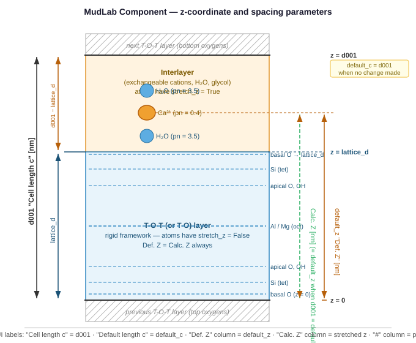

# Simulating Isomorphous Substitutions Using Atom Relations

[← Back to User Manual](../index.md)

> **Printing to PDF:** Open this page in your browser and use **File → Print → Save as PDF**.

This page explains how to use the **Atom Relations** feature in Edit Phases to simulate the full range of isomorphous (ionic) substitutions that occur in clay minerals and phyllosilicates.

---

## Background

Isomorphous substitution means one ion replaces another at a crystallographic site without changing the basic layer structure. In MudLab, the structural atom parameters `pn` (site occupancy × multiplicity) must always reflect the current substitution state. Rather than editing `pn` values by hand, **Atom Relations** let you parameterise a substitution with a single refinable value and have MudLab maintain all constraints automatically.

Two relation types are available:

| Type | Formula | Use for |
|---|---|---|
| **AtomRatio** | `atom1.pn = value × sum`; `atom2.pn = (1−value) × sum` | Binary substitution at one site |
| **AtomContents** | `atom.pn = amount × value` for each listed atom | Absolute occupancy control; master driver for coupled substitutions |

Relations can be **chained**: the target of one relation can be another relation's `value` (RATIO) or `sum` (SUM), allowing coupled multi-site substitutions to be driven by a single parameter.

---

## Prerequisites

Before adding any Atom Relation:

1. **Both atoms must already exist** in the layer or interlayer atom list.
2. Set their initial `pn` values consistently — the relation will overwrite them on first apply, but a sensible starting value avoids confusion.
3. Place them at the correct crystallographic `z` position. Substituting ions at the same site share the same `z` (or very close to it).

---

## Determining `sum`

`sum` is the total `pn` of atom1 and atom2 together at the shared site — it is what the site would carry if fully occupied by either ion. **MudLab does not compute it automatically; you set it to match your atom table.**

### MudLab unit cell convention

MudLab's default components use a **full unit cell = 2 × O₁₀(OH)₂** (the standard monoclinic unit cell for phyllosilicates, with 2 formula units per cell). All `pn` values and `sum` values in MudLab follow this convention. The reference values from the built-in default components are:

| Site | Mineral type | `sum` | Basis |
|---|---|---|---|
| Tetrahedral (per sheet) | 2:1 and 1:1, all | **4.0** | 4 sites × 1 sheet × 2 formula units / 2 sheets |
| Octahedral | 2:1 dioctahedral | **4.0** | 2 occupied sites × 2 formula units |
| Octahedral | 2:1 trioctahedral | **6.0** | 3 occupied sites × 2 formula units |
| Octahedral | 1:1 dioctahedral | **4.0** | 2 occupied sites × 2 formula units |
| Octahedral | 1:1 trioctahedral | **6.0** | 3 occupied sites × 2 formula units |
| Hydroxyl (per sheet) | all | **2.0** | 2 sites per OH-sheet × 1 formula unit |

> **Note:** crystallography textbooks often quote site multiplicities per O₁₀(OH)₂ (half cell), giving half the values above (e.g., 2 octahedral sites for dioctahedral). Always use the values that match your component's atom list, not the textbook half-cell values.

### Practical rule

Look at your atom table and read the initial `pn` values directly:

```
sum = initial_pn(atom1) + initial_pn(atom2)
```

If atom1 starts at 0 (the substituting ion) and atom2 starts at the full site occupancy:

```
sum = initial_pn(atom2)
```

### Interlayer `sum` — derived from layer charge

#### Why interlayer sum is different from T-O-T sum

In the T-O-T layer, `sum` equals the **site multiplicity** — a crystallographic constant fixed by the mineral's framework geometry (4 tetrahedral, 4 dioctahedral, 6 trioctahedral). Sites are rigid positions defined by covalent bonding, with specific coordination numbers and symmetry. Loewenstein's rule is an example of a constraint that applies specifically because these are true crystallographic sites with geometric relationships.

In the interlayer, the concept of a crystallographic site only partially applies:

- **High-charge minerals (mica, illite — charge ≈ 1.0 per O₁₀(OH)₂):** K⁺ occupies a well-defined 12-coordinated position inside the ditrigonal cavity of the tetrahedral sheet. This is effectively a crystallographic site with a fixed multiplicity (1 K per formula unit). K⁺ is non-exchangeable precisely because it fits so snugly into this cavity that it cannot be displaced by hydration. The interlayer `sum` here does correspond to a site multiplicity.

- **Low-charge minerals (smectite — charge 0.2–0.6):** Interlayer cations are hydrated and mobile — they behave more like a 2D electrolyte solution between two charged surfaces than atoms at fixed crystallographic positions. There is no true site; cation positions are statistical averages that shift with hydration state, cation type, and temperature. The `sum` you enter in MudLab is purely a charge-balance number, not a site multiplicity.

**Practical consequence:** this is why interlayer `sum` is derived from layer charge rather than read from a crystallographic table, and why there is no equivalent of Loewenstein's rule for the interlayer. The "site" is as large or as small as the layer charge makes it.

Interlayer `sum` is not a fixed crystallographic constant. It depends on the **total layer charge per unit cell**, which you calculate from the charge-generating substitutions in the layer:

```
layer_charge = Al_tet.pn + Mg_oct.pn + Fe²⁺_oct.pn   (all charge-generating pn values summed)
```

Then `sum` for the interlayer AtomRatio depends on cation valence:

| Interlayer cation | `sum` |
|---|---|
| Monovalent (Na⁺, K⁺) | `layer_charge` |
| Divalent (Ca²⁺, Mg²⁺, Fe²⁺, Ba²⁺, Sr²⁺) | `layer_charge / 2` |

**Example:** Di-Smectite default component has Ca.pn = 0.4, giving layer charge = 0.4 × 2 = **0.8 per unit cell** (= 0.4 per O₁₀(OH)₂, normal smectite range). The interlayer `sum` for a divalent cation exchange is **0.4**; for a monovalent exchange it is **0.8**.

The worked examples below use this Di-Smectite layer charge (x = 0.8 per unit cell) for all interlayer calculations.

### Reference: layer charge and interlayer cation pn ranges by mineral group

Use this table to determine realistic `sum` and `pn` values when building or checking an interlayer model. All pn values are per **MudLab full unit cell** (= 2 × O₁₀(OH)₂). Divide by 2 to get the per-formula-unit value quoted in most mineralogy references.

| Mineral group | Layer charge per O₁₀(OH)₂ | Layer charge per unit cell (×2) | Typical interlayer cation | Exchangeable? | pn per unit cell | `sum` for AtomRatio |
|---|---|---|---|---|---|---|
| Smectite | 0.20 – 0.60 | 0.40 – 1.20 | Ca²⁺ | Yes | 0.20 – 0.60 | same as Ca.pn = x/2 |
| Smectite | 0.20 – 0.60 | 0.40 – 1.20 | Na⁺ or K⁺ | Yes | 0.40 – 1.20 | same as Na.pn = x |
| Smectite | 0.20 – 0.60 | 0.40 – 1.20 | Mg²⁺ | Yes | 0.20 – 0.60 | same as Mg.pn = x/2 |
| Smectite | 0.20 – 0.60 | 0.40 – 1.20 | Fe²⁺ (reducing conditions) | Yes | 0.20 – 0.60 | same as Fe.pn = x/2 |
| Vermiculite | 0.60 – 0.80 | 1.20 – 1.60 | Mg²⁺ (natural) | Yes | 0.60 – 0.80 | x/2 |
| Vermiculite | 0.60 – 0.80 | 1.20 – 1.60 | Ca²⁺, Fe²⁺ | Yes | 0.60 – 0.80 | x/2 |
| Illite | 0.65 – 0.85 | 1.30 – 1.70 | K⁺ | No (fixed) | 1.30 – 1.70 | x |
| True mica (muscovite, phlogopite, biotite) | ~1.00 | ~2.00 | K⁺ (or Na⁺, Ca²⁺ in brittle mica) | No (fixed) | ~2.00 | x |
| Chlorite | — | — | No free cations — hydroxide sheet | No | Sheet: Mg/Fe/Al pn ≈ 6 | n/a |
| Kaolinite / serpentine | 0 | 0 | None | — | 0 | n/a |
| Talc / pyrophyllite | 0 | 0 | None | — | 0 | n/a |

**Notes:**
- The smectite–vermiculite boundary (~0.6 per O₁₀(OH)₂) marks the transition from freely swelling, fully exchangeable interlayers to partially collapsed ones. Above ~0.8, K⁺ becomes fixed (illite behaviour).
- In **chlorite**, MudLab's `interlayer_atoms` represent the fixed hydroxide sheet (brucite-like: `Mg/Fe pn ≈ 6`, gibbsite-like if Al-rich). These are structural atoms, not exchangeable cations — do not use AtomRatio for interlayer exchange in chlorite models.
- **Fe²⁺ as an interlayer cation** occurs in smectite and vermiculite under anoxic/reducing conditions. Its pn range and `sum` are identical to Mg²⁺ (both divalent).
- For **mixed-cation interlayers** (e.g., Ca + Na in smectite), the individual pn values must sum to satisfy the charge constraint — see Examples 7b and 7c.
- `sum` for an AtomRatio = pn of the fully occupied site = the value in the last column above. If you have a mixed interlayer and one cation is already partially substituted, `sum` = total pn of both atoms together.

---

## Reference: All Substitution Types

The table below lists every substitution class found in natural clay minerals. Worked examples for each follow in the sections below.

| # | Site | Original ion | Substituting ion | Charge effect | Occurs in |
|---|---|---|---|---|---|
| 1 | Tetrahedral | Si⁴⁺ | Al³⁺ | −1 per event | Beidellite, illite, mica |
| 2 | Octahedral (dioctahedral) | Al³⁺ | Mg²⁺ | −1 per event | Montmorillonite, smectite |
| 3 | Octahedral (dioctahedral) | Al³⁺ | Fe³⁺ | 0 (isovalent) | Nontronite, kaolinite |
| 4 | Octahedral (dioctahedral) | Al³⁺ | Fe²⁺ | −1 per event | Some smectites, illites |
| 5 | Octahedral (trioctahedral) | Mg²⁺ | Fe²⁺ | 0 (isovalent) | Chlorite, talc, biotite |
| 6 | Octahedral (trioctahedral) | Mg²⁺ | Fe³⁺ | +1 per event | Some chlorites |
| 7 | Tetrahedral + Octahedral | Si⁴⁺ + Mg²⁺ | Al³⁺ + Al³⁺ | 0 (coupled) | Chlorite, mica (Tschermak) |
| 8 | Octahedral | Al³⁺ | Cr³⁺ | 0 (isovalent) | Synthetic kaolinite |
| 9 | Octahedral | Al³⁺ | Ni²⁺/Zn²⁺/Cu²⁺ | −1 per event | Transition-metal-rich clays |
| 10 | Interlayer | K⁺ | Na⁺ / Ca²⁺ / Mg²⁺ | depends | Smectite, illite |
| 11 | Octahedral (two sub-groups) | Al³⁺ | Mg²⁺ + Fe²⁺ | −1 per event | Smectite (chained) |
| 12 | Hydroxyl | OH⁻ | F⁻ | 0 (isovalent) | Micas, some smectites |

---

## Worked Examples

### 1 — Tetrahedral Si → Al (beidellite, illite, mica)

**Science:** Al³⁺ enters the tetrahedral sheet, replacing Si⁴⁺. Each substitution creates one unit of negative layer charge, compensated by interlayer cations. This is the dominant charge source in beidellite and illite.

**Relation type:** `AtomRatio`

**Atoms required in layer_atoms** (one tetrahedral sheet; repeat for the second sheet if modelling both independently):

| Atom | Element | z (Å) | initial pn |
|---|---|---|---|
| Si | Si | ~1.12 | 4 |
| Al_tet | Al | ~1.12 (same site) | 0 |

**Setup:**

| Field | Value |
|---|---|
| Name | `Si-Al(tet)` |
| Sum | `4` — four tetrahedral sites per sheet per unit cell |
| Atom 1 (substituting) | `Al_tet · pn` |
| Atom 2 (original) | `Si · pn` |
| Value | substitution fraction, e.g. `0.25` |

**What `value` means:** the mole fraction of atom1 (the substituting ion) at the shared site. A value of 0.0 means pure atom2 (no substitution); a value of 1.0 means the site is fully occupied by atom1. The physically valid range is **[0.0, 1.0]**. MudLab does not enforce this in the UI — if you type a number outside this range, atom1 or atom2 will receive a negative `pn`, which is physically meaningless and will silently produce wrong structure factors. During refinement, L-BFGS-B respects the `min`/`max` bounds you set in the refinement dialog, so the bounds guard only applies there.

**Result at value = 0.25:**
```
Al_tet.pn = 0.25 × 4 = 1.0    →  1 Al per tetrahedral sheet per unit cell
Si.pn     = 0.75 × 4 = 3.0    →  3 Si per tetrahedral sheet per unit cell
```

**Refinement bounds:** `[0.0, 0.5]` — Loewenstein's rule limits Al/Si to ≤ 1, so at most half of the 4 tetrahedral sites can carry Al.

---

### 2 — Octahedral Al → Mg (montmorillonite)

**Science:** Mg²⁺ replaces Al³⁺ in the dioctahedral sheet. This is the primary source of negative layer charge in montmorillonite.

**Relation type:** `AtomRatio`

**Atoms required in layer_atoms** (dioctahedral — 4 occupied sites per unit cell = 2 sites × 2 formula units):

| Atom | Element | z (Å) | initial pn |
|---|---|---|---|
| Al_oct | Al | ~2.40 | 4 |
| Mg_oct | Mg | ~2.40 | 0 |

**Setup:**

| Field | Value |
|---|---|
| Name | `Al-Mg(oct)` |
| Sum | `4` — four dioctahedral sites per unit cell |
| Atom 1 (substituting) | `Mg_oct · pn` |
| Atom 2 (original) | `Al_oct · pn` |
| Value | substitution fraction, e.g. `0.165` |

**Result at value = 0.165:**
```
Mg_oct.pn = 0.165 × 4 = 0.66    →  0.33 Mg per O₁₀(OH)₂
Al_oct.pn = 0.835 × 4 = 3.34    →  1.67 Al per O₁₀(OH)₂
```
Layer charge per unit cell: −0.66 (= −0.33 per O₁₀(OH)₂).

---

### 3 — Octahedral Al → Fe³⁺ (nontronite, Fe-kaolinite)

**Science:** Fe³⁺ is isovalent with Al³⁺, so substitution generates **no layer charge**. The diffraction signature changes because Fe has a very different atomic scattering factor. Nontronite is the Fe³⁺-dominant end-member; kaolinite can incorporate up to ~30 mol% Fe³⁺ hydrothermally.

**Relation type:** `AtomRatio`

**Atoms required in layer_atoms:**

| Atom | Element | z (Å) | initial pn |
|---|---|---|---|
| Al_oct | Al | ~2.40 | 4 |
| Fe3_oct | Fe | ~2.40 | 0 |

**Setup:**

| Field | Value |
|---|---|
| Name | `Al-Fe3(oct)` |
| Sum | `4` |
| Atom 1 (substituting) | `Fe3_oct · pn` |
| Atom 2 (original) | `Al_oct · pn` |
| Value | Fe³⁺ fraction, e.g. `0.5` |

**Result at value = 0.5:**
```
Fe3_oct.pn = 0.5 × 4 = 2.0    →  Al₂Fe₂ per unit cell (half-substituted)
Al_oct.pn  = 0.5 × 4 = 2.0
```
No layer charge change. Use with a separate tetrahedral Si→Al relation if charge is needed (as in nontronite).

---

### 4 — Octahedral Al → Fe²⁺ (charge-generating, dioctahedral)

**Science:** Fe²⁺ replaces Al³⁺ in the dioctahedral octahedral sheet. Unlike Al → Fe³⁺ (Example 3, isovalent), Fe²⁺ is divalent — each substitution creates one unit of **negative layer charge**, exactly as Al → Mg does (Example 2). The distinction matters: Fe²⁺ is a significantly heavier scatterer than Mg²⁺, so equal charge substitutions by Fe²⁺ vs Mg²⁺ produce very different diffraction intensities, particularly at low angle.

**Relation type:** `AtomRatio`

**Atoms required in layer_atoms** (dioctahedral):

| Atom | Element/Type | z (Å) | initial pn |
|---|---|---|---|
| Al_oct | Al | ~2.40 | 4 |
| Fe2_oct | Fe²⁺ | ~2.40 | 0 |

> **AtomType:** Select the **Fe²⁺** (ferrous) ion type, not Fe³⁺. The two differ by one electron (24 vs 23 electrons) and have measurably different scattering factors at low angle.

**Setup:**

| Field | Value |
|---|---|
| Name | `Al-Fe2(oct)` |
| Sum | `4` — four dioctahedral sites per unit cell |
| Atom 1 (substituting) | `Fe2_oct · pn` |
| Atom 2 (original) | `Al_oct · pn` |
| Value | Fe²⁺ fraction, e.g. `0.1` |

**Result at value = 0.1:**
```
Fe2_oct.pn = 0.1 × 4 = 0.4    →  0.2 Fe²⁺ per O₁₀(OH)₂
Al_oct.pn  = 0.9 × 4 = 3.6    →  1.8 Al  per O₁₀(OH)₂
```
Layer charge from Fe²⁺ substitution: −0.4 per unit cell (= −0.2 per O₁₀(OH)₂).

**Refinement bounds:** `[0.0, 1.0]`. In practice Fe²⁺ rarely exceeds 0.3–0.4 of the octahedral sheet in dioctahedral smectites; use geological context to set realistic upper bounds.

---

### 5 — Trioctahedral Mg → Fe²⁺ (chlorite, talc, biotite)

**Science:** In trioctahedral phases all three octahedral sites are occupied (6 per unit cell = 3 sites × 2 formula units). Mg²⁺ and Fe²⁺ are isovalent — the substitution is charge-neutral and creates a complete solid solution (clinochlore → chamosite).

**Relation type:** `AtomRatio`

**Atoms required** (trioctahedral — 6 occupied sites per unit cell):

| Atom | Element | z (Å) | initial pn |
|---|---|---|---|
| Mg_oct | Mg | ~2.40 | 6 |
| Fe2_oct | Fe | ~2.40 | 0 |

**Setup:**

| Field | Value |
|---|---|
| Name | `Mg-Fe2(oct)` |
| Sum | `6` — six trioctahedral sites per unit cell |
| Atom 1 (substituting) | `Fe2_oct · pn` |
| Atom 2 (original) | `Mg_oct · pn` |
| Value | Fe²⁺ fraction, e.g. `0.33` |

**Result at value = 0.33:**
```
Fe2_oct.pn = 0.33 × 6 = 2.0    →  1 Fe per O₁₀(OH)₂ (Mg₂Fe₁ per formula unit)
Mg_oct.pn  = 0.67 × 6 = 4.0    →  2 Mg per O₁₀(OH)₂
```
Formula per unit cell: (Mg₄Fe₂)Si₈O₂₀(OH)₄ — intermediate clinochlore/chamosite.

---

### 5b — Trioctahedral Mg → Fe³⁺ (positive layer charge)

**Science:** Fe³⁺ is trivalent. Replacing divalent Mg²⁺ with trivalent Fe³⁺ in a trioctahedral sheet creates **positive layer charge** — +1 per substitution event. This is the opposite sign from all dioctahedral substitutions and from Mg → Fe²⁺. It occurs in Mg-rich chlorites and some Fe³⁺-bearing trioctahedral smectites.

In practice, positive charge from Fe³⁺ in the octahedral sheet partially cancels negative charge from tetrahedral Al → Si substitution (Tschermak-like balance), or it may result in layer charge approaching zero (talc-like character) if tetrahedral substitution is absent.

**Relation type:** `AtomRatio`

**Atoms required in layer_atoms** (trioctahedral — 6 occupied sites per unit cell):

| Atom | Element/Type | z (Å) | initial pn |
|---|---|---|---|
| Mg_oct | Mg | ~2.40 | 6 |
| Fe3_oct | Fe³⁺ | ~2.40 | 0 |

**Setup:**

| Field | Value |
|---|---|
| Name | `Mg-Fe3(oct)` |
| Sum | `6` — six trioctahedral sites per unit cell |
| Atom 1 (substituting) | `Fe3_oct · pn` |
| Atom 2 (original) | `Mg_oct · pn` |
| Value | Fe³⁺ fraction, e.g. `0.1` |

**Result at value = 0.1:**
```
Fe3_oct.pn = 0.1 × 6 = 0.6    →  0.3 Fe³⁺ per O₁₀(OH)₂
Mg_oct.pn  = 0.9 × 6 = 5.4    →  2.7 Mg  per O₁₀(OH)₂
```
Layer charge from this substitution: **+0.6 per unit cell** (= +0.3 per O₁₀(OH)₂).

If the same component also has a tetrahedral Si → Al substitution generating −0.3 per O₁₀(OH)₂, the net layer charge = 0 (talc-like, no interlayer cations needed).

**Refinement bounds:** `[0.0, 1.0]`. Values above ~0.5 are unusual in natural minerals; constrain by geological context. Keep an eye on the net layer charge during refinement — a positive net charge has no physical compensation mechanism in most clay models.

---

### 6 — Isovalent octahedral substitutions: Al → Cr³⁺, Ni²⁺, Zn²⁺, Cu²⁺

**Al → Cr³⁺ (isovalent, no charge):** Same setup as Example 3 (Al → Fe³⁺) — sum = 4, `AtomRatio`, no layer charge generated. Observed in synthetic kaolinites made under hydrothermal conditions. Use a `Cr` atom type.

**Al → Ni²⁺, Zn²⁺, Cu²⁺ (charge-generating, −1 per event):** These divalent transition metals replace Al³⁺ in the dioctahedral sheet. The setup is identical to Example 2 (Al → Mg) — sum = 4, `AtomRatio`, each substitution generates −1 charge unit. Occurs in transition-metal-rich clays (e.g., Ni-smectites from laterites, Cu-smectites from ore deposits). Use the appropriate ion type for the element.

| Substituting ion | Charge effect | Setup reference |
|---|---|---|
| Cr³⁺ | 0 (isovalent) | Example 3, replace `Fe3_oct` with `Cr_oct` |
| Ni²⁺ | −1 per event | Example 2, replace `Mg_oct` with `Ni_oct` |
| Zn²⁺ | −1 per event | Example 2, replace `Mg_oct` with `Zn_oct` |
| Cu²⁺ | −1 per event | Example 2, replace `Mg_oct` with `Cu_oct` |

---

### 7 — Interlayer cation substitution: K ↔ Na

**Science:** In smectites the interlayer cation is exchangeable. Swapping between monovalent species (Na⁺, K⁺) is a 1:1 exchange at the same site — a plain `AtomRatio` with `sum = layer_charge` covers this case.

**Relation type:** `AtomRatio`

**Atoms required in interlayer_atoms** (example: layer charge x = 0.8 per unit cell):

| Atom | Element | z (Å) | initial pn | stretch_z |
|---|---|---|---|---|
| K_il | K | ~d001/2 | 0.8 | True |
| Na_il | Na | ~d001/2 | 0.0 | True |

**Setup:**

| Field | Value |
|---|---|
| Name | `K-Na(interlayer)` |
| Sum | `0.8` — total layer charge per unit cell (monovalent: sum = x) |
| Atom 1 (substituting) | `Na_il · pn` |
| Atom 2 (original) | `K_il · pn` |
| Value | Na fraction, e.g. `0.0` (pure K) → `1.0` (pure Na) |

**Result at value = 0.5:**
```
Na_il.pn = 0.5 × 0.8 = 0.4    →  0.4 Na per unit cell
K_il.pn  = 0.5 × 0.8 = 0.4    →  0.4 K per unit cell
Total charge = 0.4 + 0.4 = 0.8 ✓
```

---

### 7b — Interlayer Ca²⁺ ↔ Na⁺ substitution (mixed valence)

**Science:** Ca²⁺ and Na⁺ have different charges (2+ vs 1+), so they cannot share a site on a 1:1 basis. Each Ca²⁺ compensates two units of layer charge; each Na⁺ compensates one. For a layer charge of `x` per unit cell the charge constraint is:

```
2 × Ca.pn  +  1 × Na.pn  =  x
```

Because of this asymmetry, a simple `AtomRatio` (which applies the same sum to both atoms) cannot enforce the constraint. The recommended approach is a single `AtomContents` relation for Ca, with Na.pn maintained manually.

**Parameterisation:** let `f` = Ca charge fraction [0, 1]:
- `Ca.pn = f × x/2` — Ca ions, each contributing 2 charge units
- `Na.pn = (1 − f) × x` — Na ions, each contributing 1 charge unit

At `f = 0` the interlayer is pure Na; at `f = 1` it is pure Ca.

**Atoms required in interlayer_atoms** (example: x = 0.8 per unit cell):

| Atom | Element | z (Å) | initial pn | stretch_z |
|---|---|---|---|---|
| Ca_il | Ca | ~d001/2 | 0.4 | True |
| Na_il | Na | ~d001/2 | 0.0 | True |

**Relation — `Ca_contents` (AtomContents):**

| Field | Value |
|---|---|
| Name | `Ca(interlayer)` |
| Value | `f` — Ca charge fraction, e.g. `1.0` (pure Ca) |
| Atom contents | `Ca_il · pn`, amount = `x/2` = `0.4` |

**Na.pn is not linked automatically** — set it manually to `(1 − f) × x` whenever you change `f`. MudLab cannot express a complement `(1 − value)` in a single relation.

**Result at f = 0.5** (equal charge from Ca and Na):
```
Ca_il.pn = 0.5 × 0.4 = 0.2    →  contributes 0.4 charge units
Na_il.pn = (1 − 0.5) × 0.8 = 0.4  →  contributes 0.4 charge units
Total charge = 0.2 × 2 + 0.4 × 1 = 0.8 ✓
```

**Refinement:** Select `Ca_contents · value` as the refinable parameter. Bounds: `[0.0, 1.0]`. After refinement, compute `Na.pn = (1 − f_refined) × x` and update it manually before interpreting composition results.

> **Ca–Mg interlayer:** the same setup applies for Ca²⁺ ↔ Mg²⁺ (both divalent — isovalent in terms of charge). Use `AtomRatio` with `sum = x/2 = 0.4`, atom1 = Mg_il, atom2 = Ca_il. No valence correction needed.

---

### 7c — Interlayer Ca²⁺ replaced by Fe²⁺, Ba²⁺, or Sr²⁺

**Science:** Fe²⁺, Ba²⁺, and Sr²⁺ are all divalent, so each substitutes Ca²⁺ on a 1:1 basis without altering the layer charge balance. The setup is identical for all three; only the element and ionic radius differ.

| Substituting ion | Occurs in | Ionic radius (8-coord) | Effect on d001 |
|---|---|---|---|
| Fe²⁺ | Anoxic/hydrothermal environments | ~0.92 Å | Slight decrease vs Ca |
| Sr²⁺ | Natural smectites, ⁹⁰Sr retention studies | ~1.18 Å | Slight increase vs Ca |
| Ba²⁺ | Hydrothermal systems, radioactive waste | ~1.36 Å | Noticeable increase vs Ca |

Because both ions in each pair are divalent, a plain `AtomRatio` with `sum = x/2` is correct — no valence correction needed (contrast with Example 7b, Ca ↔ Na).

**Relation type:** `AtomRatio`

**Atoms required in interlayer_atoms** (example: layer charge x = 0.8 per unit cell, so sum = 0.4):

| Atom | Element | z (Å) | initial pn | stretch_z |
|---|---|---|---|---|
| Ca_il | Ca | ~d001/2 | 0.4 | True |
| Fe_il | Fe | ~d001/2 | 0.0 | True |
| Ba_il | Ba | ~d001/2 | 0.0 | True |
| Sr_il | Sr | ~d001/2 | 0.0 | True |

Add only the atoms relevant to the substitution being modelled.

**Setup (Ca ↔ Sr):**

| Field | Value |
|---|---|
| Name | `Ca-Sr(interlayer)` |
| Sum | `0.4` — half the layer charge (x/2) |
| Atom 1 (substituting) | `Sr_il · pn` |
| Atom 2 (original) | `Ca_il · pn` |
| Value | Sr²⁺ fraction, e.g. `0.5` |

**Result at value = 0.5:**
```
Sr_il.pn = 0.5 × 0.4 = 0.2    →  50 % of interlayer sites carry Sr²⁺
Ca_il.pn = 0.5 × 0.4 = 0.2    →  50 % carry Ca²⁺
Total charge = (0.2 + 0.2) × 2 = 0.8 ✓
```

For Ca ↔ Fe²⁺, use atom1 = `Fe_il`, atom2 = `Ca_il`, same sum.

**Setup (Ca ↔ Ba):**

| Field | Value |
|---|---|
| Name | `Ca-Ba(interlayer)` |
| Sum | `0.4` |
| Atom 1 (substituting) | `Ba_il · pn` |
| Atom 2 (original) | `Ca_il · pn` |
| Value | Ba²⁺ fraction, e.g. `0.3` |

**Result at value = 0.3:**
```
Ba_il.pn = 0.3 × 0.4 = 0.12    →  30 % of interlayer sites carry Ba²⁺
Ca_il.pn = 0.7 × 0.4 = 0.28    →  70 % carry Ca²⁺
Total charge = (0.12 + 0.28) × 2 = 0.8 ✓
```

**Refinement bounds:** `[0.0, 1.0]` for all three cases.

> **AtomType note for Fe²⁺:** select the ferrous iron ion type (Fe²⁺) in the AtomType dropdown, not Fe³⁺. The two have slightly different scattering factors at low angle due to their different electron counts (24 vs 23 electrons).

---

### 8 — Hydroxyl → Fluorine substitution

**Science:** F⁻ replaces OH⁻ at the hydroxyl position in the octahedral sheet. Both are monovalent anions of similar ionic radius — no charge is generated. F-substitution increases thermal stability. Occurs in micas, some smectites, and chlorites.

**Atoms required in layer_atoms (or interlayer_atoms for brucite-like sheets):**

| Atom | Element | z (Å) | initial pn |
|---|---|---|---|
| OH_layer | OH | ~0.0 or top of sheet | 2 |
| F_layer | F | same z | 0 |

> **AtomType:** You need an `OH` type and an `F` type already defined in the AtomTypes table. The scattering factors differ — this substitution changes the calculated intensity near low-angle reflections.

**Setup:**

| Field | Value |
|---|---|
| Name | `OH-F` |
| Sum | `2` — two hydroxyl sites per OH-sheet per unit cell |
| Atom 1 (substituting) | `F_layer · pn` |
| Atom 2 (original) | `OH_layer · pn` |
| Value | F fraction, e.g. `0.0` (pure hydroxyl) |

---

### 9 — Al replaced simultaneously by Mg and Fe²⁺ (chained substitution)

**Science:** In some smectites, both Mg²⁺ and Fe²⁺ replace Al³⁺ in the octahedral sheet. The total substitution is one parameter; the Mg/Fe split is a second, independent parameter. Both can be refined.

This uses **two chained AtomRatio relations**:
- `AtomRatio_MgFe_for_Al` — controls how much of the octahedral Al is replaced (total divalent content)
- `AtomRatio_Mg_for_Fe` — controls the Mg/Fe split within the divalent fraction; its **sum is driven** by the first relation's output via the SUM channel

**Atoms required:**

| Atom | Element | z (Å) | initial pn |
|---|---|---|---|
| Al_oct | Al | ~2.40 | 4 |
| Mg_oct | Mg | ~2.40 | 0 |
| Fe2_oct | Fe | ~2.40 | 0 |

**Relation 1 — `AtomRatio_MgFe_for_Al`:**

| Field | Value |
|---|---|
| Name | `(Mg+Fe)-Al(oct)` |
| Sum | `4` |
| Atom 1 | `AtomRatio_Mg_for_Fe · SUM` ← targets the second relation's sum |
| Atom 2 | `Al_oct · pn` |
| Value | total divalent fraction, e.g. `0.4` |

**Relation 2 — `AtomRatio_Mg_for_Fe`:**

| Field | Value |
|---|---|
| Name | `Mg-Fe(oct)` |
| Sum | driven by Relation 1 (do not edit manually) |
| Atom 1 | `Mg_oct · pn` |
| Atom 2 | `Fe2_oct · pn` |
| Value | Mg fraction within divalent group, e.g. `0.6` |

**Result at value₁ = 0.4, value₂ = 0.6:**
```
Al_oct.pn  = (1 − 0.4) × 4 = 2.4
(Mg + Fe) total = 0.4 × 4 = 1.6     (passed to Relation 2 as its sum)
  Mg_oct.pn  = 0.6 × 1.6 = 0.96
  Fe2_oct.pn = 0.4 × 1.6 = 0.64
```

**Refinement:** Relation 1's `value` and Relation 2's `value` are both independently refinable. Relation 2's `sum` is not refinable (driven by Relation 1). Relation 2's `driven_by_other` flag is NOT set (sum-driving does not lock the value), so both values appear in the refinement parameter list.

---

### 10 — Tschermak coupled substitution (simultaneous tetrahedral + octahedral)

**Science:** The Tschermak substitution couples a tetrahedral and an octahedral exchange so that overall charge balance is maintained:

```
Mg²⁺ (octahedral) + Si⁴⁺ (tetrahedral)  →  Al³⁺ (octahedral) + Al³⁺ (tetrahedral)
```

Both changes must move by the same amount `x` (one Tschermak unit = one ion swapped at each site simultaneously). This is important in chlorites and micas where pure Tschermak exchange is the dominant solid-solution vector.

This uses **one `AtomContents` master** driving the `value` of **two `AtomRatio` slaves**.

**Atoms required** (trioctahedral example — chlorite 2:1 layer):

| Sheet | Atom | Element | z (Å) | initial pn |
|---|---|---|---|---|
| Layer (tet) | Si | Si | ~1.12 | 4 |
| Layer (tet) | Al_tet | Al | ~1.12 | 0 |
| Layer (oct) | Mg_oct | Mg | ~2.40 | 6 |
| Layer (oct) | Al_oct | Al | ~2.40 | 0 |

**Relation 1 — `AtomRatio_tet` (slave):**

| Field | Value |
|---|---|
| Name | `Si-Al(tet) [Tschermak]` |
| Sum | `4` |
| Atom 1 | `Al_tet · pn` |
| Atom 2 | `Si · pn` |
| Value | `0` initially — will be driven by master |

**Relation 2 — `AtomRatio_oct` (slave):**

| Field | Value |
|---|---|
| Name | `Mg-Al(oct) [Tschermak]` |
| Sum | `6` |
| Atom 1 | `Al_oct · pn` |
| Atom 2 | `Mg_oct · pn` |
| Value | `0` initially — will be driven by master |

**Relation 3 — `AtomContents_Tschermak` (master, refinable):**

| Field | Value |
|---|---|
| Name | `Tschermak` |
| Value | `x` — the Tschermak substitution fraction |
| Atom contents | `(AtomRatio_tet · RATIO, amount = 1.0)` |
| | `(AtomRatio_oct · RATIO, amount = 1.0)` |

The master sets both slaves' `value` to `x × 1.0 = x`. Each slave then applies its own sum:

**Result at x = 0.25:**
```
Tetrahedral:  Al_tet.pn = 0.25 × 4 = 1.0;   Si.pn    = 0.75 × 4 = 3.0
Octahedral:   Al_oct.pn = 0.25 × 6 = 1.5;   Mg_oct.pn = 0.75 × 6 = 4.5
```
Net charge change: −1 (tet) + 1 (oct) = **0** — Tschermak is charge-neutral.

**Refinement:** Only the master `AtomContents` value is refinable. The two slave `AtomRatio` values carry `driven_by_other = True` and are excluded from the refinement parameter list automatically.

> **Order in the atom relations list matters for value-driven chains.** The master must appear **before** both slaves so that when `_apply_atom_relations` iterates, the slaves' `value` is already updated before their `apply_relation()` runs.

---

### 11 — Interlayer water content (hydration state)

**Science:** Smectites swell by intercalating water molecules in the interlayer. Different hydration states (dehydrated, 1-water layer, 2-water layer, glycolated) differ in d001 and in the number and arrangement of H2O molecules per unit cell. MudLab models each hydration state as a separate component, with H2O atoms in `interlayer_atoms` and an `AtomContents` relation controlling their count.

**Relation type:** `AtomContents`

**Key difference from substitution examples:** `value` here is not a mole fraction — it is the **direct H2O count per interlayer position per unit cell**. Each H2O atom has `amount = 1.0`, so:

```
H2O_atom.pn = value × 1.0 = value
```

**Interlayer structure across hydration states** (from MudLab Di-Smectite defaults, Ca²⁺, full unit cell):

| State | d001 (nm) | H2O atoms | H2O value | Ca.pn |
|---|---|---|---|---|
| Dehydrated | 0.998 | none | — | 0.4 |
| 1-water layer (1WAT) | 1.25 | 1 (single plane) | 3.5 | 0.4 |
| 2-water layer (2WAT) | 1.50 | 2 (above + below Ca) | 3.5 each | 0.4 |

The Ca content stays constant across all states — only the water changes.

**2WAT interlayer atom layout:**

```
[ H2O_top   pn = 3.5 ]   ← H2O atom, stretch_z = True, z ≈ 0.25 × d001
[ Ca_il     pn = 0.4 ]   ← Ca atom,  stretch_z = True, z ≈ 0.50 × d001
[ H2O_bot   pn = 3.5 ]   ← H2O atom, stretch_z = True, z ≈ 0.75 × d001
```

**Atoms required in interlayer_atoms (2WAT):**

| Atom | Element | z (Å) | initial pn | stretch_z |
|---|---|---|---|---|
| H2O_top | H2O | ~d001 × 0.25 | 3.5 | True |
| Ca_il | Ca | ~d001 × 0.50 | 0.4 | True |
| H2O_bot | H2O | ~d001 × 0.75 | 3.5 | True |

**Setup — `H2O content` (AtomContents):**

| Field | Value |
|---|---|
| Name | `H2O content` |
| Value | `3.5` — H2O molecules per interlayer position per unit cell |
| Atom contents | `H2O_top · pn`, amount = `1.0` |
| | `H2O_bot · pn`, amount = `1.0` |

The single relation keeps both H2O planes synchronised — changing `value` updates both simultaneously.

**For 1WAT:** only one H2O atom in the interlayer; the relation has a single entry. `value` = 3.5 (same count, one position instead of two).

**For dehydrated or glycolated states:** no H2O atoms and no H2O content relation. Replace H2O atoms with glycol (EG) atoms at the appropriate z positions for glycolation.

**Refinement:** `value` is refinable. Refining it allows MudLab to fit the effective water content from the diffraction pattern. In mixed-layer models (e.g., randomly interstratified 1WAT/2WAT), the water content per component is usually fixed at the crystallographic value and the layer proportions are refined instead via the probability matrix.

> **AtomType:** The `H2O` atom type in MudLab uses a molecular scattering factor for a water molecule (not just oxygen). Ensure you select the `H2O` type, not `O`, for the interlayer water atoms.

> **H2O content and d001 are fully decoupled.** Changing the H2O content `value` only updates `pn` (the scattering contribution). It has no effect on d001 or any atom z-coordinates. Conversely, changing d001 stretches all interlayer atom z-coordinates proportionally (via `stretch_z`) but does not touch `pn`. The user must set both consistently: e.g., `H2O content = 3.5` AND `d001 = 1.50 nm` for the 2WAT state. MudLab has no built-in knowledge that a given water count implies a particular basal spacing.

---

### 12 — Glycol content and glycolation states

#### Glycol vs H2O: always separate relations

Glycol (ethylene glycol, EG) and H2O occupy **different z positions** and use **different AtomTypes** (`Glycol` vs `H2O`). A single `AtomContents` can only drive atoms to `amount × value` — it cannot set two different atom types to different values in one step. **Glycol content and water content are always separate relations.**

#### Complete glycolation — 1GLY state (d001 ≈ 1.29 nm)

In the fully glycolated 1GLY state, all interlayer water is replaced by a single glycol bilayer. There are no H2O atoms and no water content relation.

**Atoms required in interlayer_atoms:**

| Atom | Element/Type | z (Å) | initial pn | stretch_z |
|---|---|---|---|---|
| Gly_top | Glycol | ~d001 × 0.25 | 2.0 | True |
| Ca_il | Ca | ~d001 × 0.50 | 0.4 | True |
| Gly_bot | Glycol | ~d001 × 0.75 | 2.0 | True |

**Relation — `Glycol content` (AtomContents):**

| Field | Value |
|---|---|
| Name | `Glycol content` |
| Value | `2.0` — glycol molecules per position per unit cell |
| Atom contents | `Gly_top · pn`, amount = `1.0` |
| | `Gly_bot · pn`, amount = `1.0` |

Both glycol planes are synchronised by a single relation, exactly as H2O was in Example 11.

#### Expanded glycolation — 2GLY state (d001 ≈ 1.686 nm)

The 2GLY state intercalates two glycol bilayers (one on each side of the cation plane) with a residual H2O layer between them. It has **both** a Glycol content relation and a Water content relation, independently controlling four Glycol atoms and two H2O atoms:

```
[ Gly  pn=1.7 ]   z ≈ d001 × 0.83
[ Gly  pn=1.7 ]   z ≈ d001 × 0.78
[ H2O  pn=1.2 ]   z ≈ d001 × 0.73
[ Ca   pn=0.4 ]   z ≈ d001 × 0.70  (centre)
[ H2O  pn=1.2 ]   z ≈ d001 × 0.67
[ Gly  pn=1.7 ]   z ≈ d001 × 0.61
[ Gly  pn=1.7 ]   z ≈ d001 × 0.56
```

**Relations (from MudLab Di-Smectite 2GLY default):**

| Relation | Type | Value | Atoms controlled |
|---|---|---|---|
| `Glycol content` | AtomContents | 1.7 | all 4 Glycol atoms, amount=1.0 each |
| `Water content` | AtomContents | 1.2 | both H2O atoms, amount=1.0 each |
| `Ca content` | AtomContents | 0.4 | Ca_il, amount=1.0 |

The glycol and water values in the 2GLY state are not free parameters — they are crystallographically constrained by the d001 and layer charge. Use the values from the default component as a starting point.

#### Incomplete glycolation — mixed-layer approach

Incomplete glycolation means the sample contains a **mixture of glycolated and non-glycolated (collapsed) layers** in the same crystallite. This is a stacking disorder problem, not a single-component problem. It is modeled at the **Phase level** using multiple components:

| Phase setup | G | Components | Use for |
|---|---|---|---|
| Fully glycolated | 1 | 1GLY only | Pure glycolated smectite |
| Incomplete (random) | 2 | 1GLY + Dehydr (or 1WAT), R0 | Random interstratification |
| Incomplete (ordered) | 2 | 1GLY + Dehydr, R1 | Ordered alternation |

In the G=2 case, the Probabilities tab controls the proportion of glycolated vs collapsed layers. The diffraction pattern will show a broadened, shifted 001 reflection characteristic of incomplete glycolation rather than discrete peaks.

> **Approximation sometimes used:** reducing the Glycol content `value` below 2.0 in a single-component model to simulate partial interlayer filling (e.g., value=1.5 for ~75% glycolation). This is unphysical — it blurs the distinction between glycolated and non-glycolated layers — but can give an adequate fit when the degree of interstratification is low and the goal is simply to account for the shift in d001.

---

## Understanding z-coordinates and spacing parameters

### Diagram



### What each parameter means

| Parameter | UI label (Components tab) | Relates to | Changes during refinement? |
|---|---|---|---|
| `d001` | **Cell length c** [nm] | Whole unit cell — T-O-T + interlayer together | Yes — primary refinable spacing |
| `default_c` | **Default length c** [nm] | Reference value of d001 at which atom positions were defined | Rarely — set once when building the component |
| `lattice_d` | *(not shown directly)* | T-O-T layer thickness only — computed automatically | No — fixed by layer atom positions |
| `default_z` | **Def. Z** column [nm] | A stored z-position in nm, valid as the actual position when `d001 = default_c`. For **layer atoms** it is the permanent final position used directly in the calculation. For **interlayer atoms** it is the reference from which `Calc. Z` is derived by the stretch formula — `default_z` itself never changes, only `Calc. Z` moves. | No — stored permanently for all atoms |
| `z` (computed) | **Calc. Z** column [nm] | Actual z used in the structure-factor calculation | Yes — follows d001 for interlayer atoms |
| `pn` | **#** column | Atoms per unit cell projected onto c-axis (site occupancy × multiplicity) | If `refinable=True` |
| `stretch_z` | *(not shown — internal flag)* | Whether this atom's z scales with d001 | — |

### How the stretch works

When `d001` differs from `default_c`, MudLab keeps the rigid T-O-T framework frozen and rescales only the interlayer space:

```
z_factor = (d001 − lattice_d) / (default_c − lattice_d)

Calc. Z  =  lattice_d  +  (default_z − lattice_d) × z_factor
```

- `z_factor = 1.0` when `d001 = default_c` → Calc. Z = Def. Z (no change)
- `z_factor > 1.0` when `d001 > default_c` → interlayer expands; atoms move outward
- `z_factor < 1.0` when `d001 < default_c` → interlayer compresses; atoms move inward

**Layer atoms** (`stretch_z = False`) always use `Def. Z` directly — they never move.  
**Interlayer atoms** (`stretch_z = True`) always use `Calc. Z` — they track d001.

### UI column reference

In the atom table of the **Components tab**:

| Column header | Internal name | Edit? | Meaning |
|---|---|---|---|
| Atom name | `name` | Yes | User-assigned label |
| **Def. Z (nm)** | `default_z` | Yes | Reference z position — what you enter |
| **Calc. Z (nm)** | `z` | No (read-only) | Actual z used in calculation — changes with d001 for interlayer atoms |
| **#** | `pn` | Yes | Occupancy × multiplicity per unit cell |
| Atom type | `atom_type` | Yes | Scattering factor set |

### Practical tips

**Setting up a new component:**

1. Set `default_c` (Default length c) to the expected d001 for the state you're building (e.g., 1.50 nm for a 2WAT smectite). All `default_z` values you enter will be calibrated to this spacing.
2. Enter atom positions (`Def. Z`) from the literature or a CIF for that d001. The `Calc. Z` column will show the same values while d001 = default_c.
3. Set `stretch_z = True` for all interlayer atoms (cations, H₂O, glycol). Leave it `False` for all layer atoms.

**Changing hydration state:**

- To switch a component from 2WAT (d001 = 1.50 nm) to 1WAT (d001 = 1.25 nm): change only `Cell length c`. All interlayer `Calc. Z` values will update automatically. The `Def. Z` values remain unchanged as stored reference positions.
- Also update the H₂O content relation value and remove/add H₂O atoms to match the new state — MudLab does not do this automatically (see Example 11).

**Refinement:**

- Refine `Cell length c` (d001) to fit the peak position. Interlayer z-coordinates follow automatically.
- Refine `Default length c` only if you want to change the reference frame — this is unusual. Normally leave it fixed.
- `Def. Z` values of interlayer atoms are not directly refinable. If you need to refine an interlayer atom position independently of the d001 stretch, use the `default_z` as a fixed offset and refine d001 to shift the whole interlayer.

**When Calc. Z looks wrong:**

If a `Calc. Z` value is outside the expected interlayer range, check:
1. Is `stretch_z` set to `True` for that atom?
2. Is `default_c` set to a sensible starting d001? If `default_c` was left at 0 or at an incorrect value, z_factor will be wrong.
3. Is `lattice_d` reasonable? It is computed from the maximum `Def. Z` of all layer atoms — if a layer atom has an unusually large `Def. Z`, `lattice_d` will be inflated and the interlayer stretch will be compressed.

---

## Using the Atom Relations Dialogs — Step by Step

### The Atom Relations panel

The **Atom Relations** panel sits at the bottom of the right-hand editor in the **Edit Phases → Components tab**. It is an inline list with five columns:

| Column | What it shows | How to interact |
|---|---|---|
| **Name** | Relation name | Click cell to edit inline |
| **Value** | Current value (Ratio or Content) | Click cell to edit inline — plot updates live |
| **↑** | Move relation up in list | Click to reorder (order matters for chained relations) |
| **↓** | Move relation down | Same |
| **✏** | Open full edit dialog | Click to open |

Above the list: a **type selector** (drop-down: `Ratio` / `Contents`) and a **＋** button to add a new relation of the selected type.

> **The Value cell is the fastest way to change a substitution level** — click it, type, press Enter. You do not need to open the pencil dialog for a simple value change. The calculated pattern updates immediately if a mixture is set up.

---

### Adding an AtomRatio — worked example (Al → Mg, montmorillonite)

**Before you start:** both atoms must already exist in the layer or interlayer atom table with sensible initial `pn` values. For this example: `Al_oct` pn=4, `Mg_oct` pn=0 (both at z≈2.40 Å in `layer_atoms`).

**Step 1 — Select type.** In the type selector above the Atom Relations list, choose **Ratio**.

**Step 2 — Add.** Click **＋**. A new row appears: `AtomRatio` with Name=empty, Value=0.

**Step 3 — Open the edit dialog.** Click the **✏** button on the new row. The AtomRatio dialog opens with these fields:

```
Name            [ text entry          ]
Enabled         [ ☑ checkbox          ]
Substituting atom  [ dropdown         ]
Original atom      [ dropdown         ]
Ratio           [ text entry          ]   ← this is "Value"
Sum             [ text entry          ]
```

**Step 4 — Set Name.** Type a descriptive name: `Al-Mg(oct)`.

**Step 5 — Leave Enabled checked.**

**Step 6 — Set Substituting atom.** Click the dropdown. It lists every atom in `layer_atoms` and `interlayer_atoms`, plus any other relations' output channels (`RelationName: SUM`, `RelationName: RATIO`). Select `Mg_oct · pn`.

**Step 7 — Set Original atom.** Select `Al_oct · pn`.

**Step 8 — Set Sum.** Type `4` (four dioctahedral sites per unit cell — see the *Determining sum* section).

**Step 9 — Set Ratio (Value).** Type the starting substitution fraction, e.g. `0.165`. You can change this later by clicking the Value cell in the list directly.

**Step 10 — Close the dialog.** The relation is now active. The atom pn values update immediately:
```
Mg_oct.pn = 0.165 × 4 = 0.66
Al_oct.pn = 0.835 × 4 = 3.34
```
If a mixture is set up, the calculated pattern redraws.

> **Refinement:** In the Refinement dialog, this relation's Value appears in the parameter list as `Al-Mg(oct) · value`. Set `min = 0.0`, `max = 1.0` (or a tighter geological bound).

---

### Adding an AtomContents — worked example (H₂O content, 2WAT smectite)

**Before you start:** the H₂O atoms must exist in `interlayer_atoms` — e.g., `H2O_top` pn=3.5 and `H2O_bot` pn=3.5, both with `stretch_z = True`.

**Step 1 — Select type.** Choose **Contents** in the type selector.

**Step 2 — Add.** Click **＋**. A new row appears: `AtomContents` with Name=empty, Value=0.

**Step 3 — Open the edit dialog.** Click **✏**. The AtomContents dialog opens:

```
Name            [ text entry                  ]
Enabled         [ ☑ checkbox                 ]
Atom contents   [ inline table (150 px tall)  ]
                  Atoms | Default contents
Content         [ text entry                  ]   ← this is "Value"
```

**Step 4 — Set Name.** Type `H2O content`.

**Step 5 — Populate the atom contents table.** Click **＋** inside the Atom contents table to add a row.
- In the **Atoms** dropdown, select `H2O_top · pn`.
- In the **Default contents** column, type `1.0` (amount).
- Click **＋** again, select `H2O_bot · pn`, amount = `1.0`.

**Step 6 — Set Content (Value).** Type `3.5` — the number of H₂O molecules per interlayer position per unit cell.

**Step 7 — Close.** Both H₂O atoms now have pn = 3.5 × 1.0 = 3.5.

> **For Ca content:** same steps, one atom (`Ca_il · pn`), amount = `1.0`, Value = `0.4`.

---

### Setting VALUE — quick reference by context

| Context | Relation type | What Value means | Typical range |
|---|---|---|---|
| T-O-T layer substitution (Al/Mg/Fe/Cr…) | AtomRatio | Mole fraction of substituting ion at the site | [0.0, 1.0] |
| Interlayer monovalent exchange (K/Na) | AtomRatio | Fraction of site occupied by substituting ion | [0.0, 1.0] |
| Interlayer divalent exchange (Ca/Sr/Ba…) | AtomRatio | Fraction of site occupied by substituting ion | [0.0, 1.0] |
| Interlayer divalent Ca pn (Ca↔Na) | AtomContents | Ca charge fraction — Ca.pn = Value × (x/2) | [0.0, 1.0] |
| H₂O / Glycol content | AtomContents | Molecules per interlayer position per unit cell — **not a fraction** | 0 – ~4 |
| Tschermak master | AtomContents | Tschermak substitution fraction — drives two AtomRatio values | [0.0, ~0.5] |

---

### Modelling T-O-T layer substitutions

For **any** layer substitution (tetrahedral or octahedral):

1. Add both atoms to `layer_atoms` at the **same** `Def. Z` (same crystallographic site, `stretch_z = False`).
2. Set the original atom's initial pn = site multiplicity (e.g., 4 for tetrahedral, 4 for dioctahedral oct, 6 for trioctahedral oct). Set the substituting atom's initial pn = 0.
3. Create an **AtomRatio** with Sum = site multiplicity, Substituting atom = new ion, Original atom = original ion.
4. Set Value to the starting substitution level. For refinement, set min=0, max as appropriate (e.g., max=0.5 for tetrahedral Al due to Loewenstein's rule).

**Two tetrahedral sheets:** A 2:1 clay has two separate tetrahedral sheet entries in the atom list (top and bottom). If you want to substitute both sheets equally, create **two AtomRatio relations** — one per sheet, each with sum=4. If the sheets are identical in substitution (usual assumption), give them the same Value and the same name suffix.

---

### Modelling interlayer exchanges

For **monovalent–monovalent exchange** (K ↔ Na, Na ↔ NH₄…):

1. Both atoms in `interlayer_atoms`, `stretch_z = True`.
2. **AtomRatio**, Sum = layer charge per unit cell (see *Determining sum*).
3. Value = fraction of site occupied by the substituting ion.

For **divalent–divalent exchange** (Ca ↔ Mg, Ca ↔ Sr, Ca ↔ Ba…):

1. Both atoms in `interlayer_atoms`, `stretch_z = True`.
2. **AtomRatio**, Sum = layer charge / 2.
3. Value = fraction of sites occupied by substituting ion.

---

### Dealing with unequal charges (e.g., Ca²⁺ ↔ Na⁺)

`AtomRatio` applies the same sum to both atoms — it cannot enforce the charge constraint `2×Ca.pn + Na.pn = x` for mixed-valence exchanges.

**Recommended approach:**

1. Create an **AtomContents** for the **divalent** cation (Ca):
   - Atom contents: `Ca_il · pn`, amount = `x/2` (half the layer charge)
   - Value = Ca charge fraction `f` [0, 1]
   - This sets Ca.pn = f × (x/2)

2. Set `Na_il.pn` **manually** = `(1 − f) × x` whenever you change f. There is no way to automate this complement in a single MudLab relation.

3. For refinement: select only the AtomContents Value as the refinable parameter. After the run, recompute and manually update Na.pn.

The same logic applies to any pair where the cation valences differ (e.g., monovalent ↔ trivalent Al³⁺, though this is uncommon).

---

### Common mistakes

| Mistake | Symptom | Fix |
|---|---|---|
| Atoms not yet in the atom table before adding the relation | Dropdown shows nothing or wrong atoms | Add layer/interlayer atoms first, then create the relation |
| Sum set to the per-O₁₀(OH)₂ (half-cell) value instead of the full unit cell value | pn values are half of expected | Double the sum — MudLab uses 2 formula units per unit cell |
| Value outside [0, 1] for AtomRatio | One atom gets negative pn; silent wrong structure factors | Correct the Value; set refinement min/max to clamp it |
| H₂O content Value set to a fraction (e.g., 0.35) instead of a count (e.g., 3.5) | H₂O pn wildly wrong | Value for H₂O/Glycol content = molecule count, not fraction |
| Master AtomContents placed **after** its slave AtomRatios in the list | Slaves run with stale value; first calculation step is wrong | Move master above slaves using the ↑ button |
| stretch_z not set on interlayer atoms | Interlayer atoms don't move when d001 changes | Open atom editor, enable stretch_z for all interlayer atoms |

---

## Summary: Choosing the Right Setup

| Substitution | Relation type | Notes |
|---|---|---|
| Single binary, one site | `AtomRatio` | Standard case |
| Isovalent (no charge change) | `AtomRatio` | Same setup; charge balance automatic |
| Two species replacing one (Mg+Fe for Al) | Two `AtomRatio`, chained via SUM | Second relation's sum is driven |
| Simultaneous two-site (Tschermak) | One `AtomContents` + two `AtomRatio`, chained via RATIO | Master drives both slaves' value |
| Absolute occupancy control | `AtomContents` | Used when site is not binary |

---

## Related source files

| Role | File |
|---|---|
| Relation models | `mudlab/phases/models/atom_relations.py` |
| Apply loop | `mudlab/phases/models/component.py` → `_apply_atom_relations()` |
| UI controllers | `mudlab/phases/controllers/atom_relation_controllers.py` |

---

[← Back to User Manual](../index.md)
